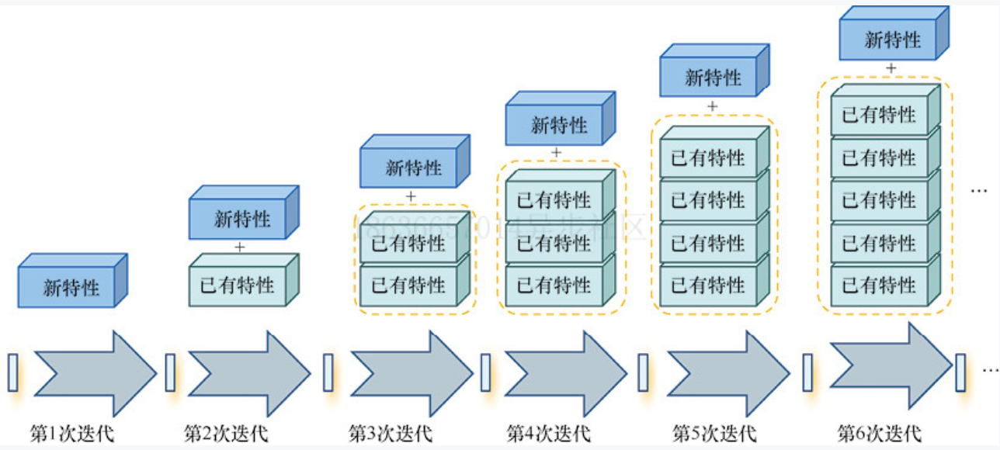

**目录（Table of Contents）**

[TOC]
------
## 1、自动化测试策略以及测试目标
在确认自动化测试目标之前，先给大家分享下自动化测试优缺点，以及自动化接口测试在自动化测试中的优势。
### 1.1 自动化测试优缺点
#### 1.1.1 优点
* 自动化测试可以替代大量的手工机械重复性操作，测试工程师可以把更多的时间花在更全面的用例设计和新功能的测试上
* 自动化测试可以大幅提升回归测试的效率，非常适合敏捷开发过程
* 自动化测试可以更好地利用无人值守时间，去更频繁地执行测试，特别适合现在非工作时间执行测试，工作时间分析失败用例的工作模式
* 自动化测试可以高效实现某些手工测试无法完成或者代价巨大的测试类型，比如关键业务7×24小时持续运行的系统稳定性测试和高并发场景的压力测试等
* 自动化测试还可以保证每次测试执行的操作以及验证的一致性和可重复性，避免人为的遗漏或疏忽
#### 1.1.2 缺点
* 自动化测试并不能取代手工测试，它只能替代手工测试中执行频率高、机械化的重复步骤。你千万不要奢望所有的测试都自动化，否则一定会得不偿失
* 自动测试远比手动测试脆弱，无法应对被测系统的变化，业界一直有句玩笑话“开发手一抖，自动化测试忙一宿”，这也从侧面反映了自动化测试用例的维护成本一直居高不下的事实
* 自动化测试用例的开发工作量远大于单次的手工测试，所以只有当开发完成的测试用例的有效执行次数大于等于5次时，才能收回自动化测试的成本
* 手工测试发现的缺陷数量通常比自动化测试要更多，并且自动化测试仅仅能发现回归测试范围的缺陷
* 测试的效率很大程度上依赖自动化测试用例的设计以及实现质量，不稳定的自动化测试用例实现比没有自动化更糟糕
* 实行自动化测试的初期，用例开发效率通常都很低，大量初期开发的用例通常会在整个自动化测试体系成熟，和测试工程师全面掌握测试工具后，需要重构
* 业务测试专家和自动化测试专家通常是两批人，前者懂业务不懂自动化技术，后者懂自动化技术但不懂业务，只有二者紧密合作，才能高效开展自动化测试
* 自动化测试开发人员必须具备一定的编程能力，这对传统的手工测试工程师会是一个挑战
### 1.2 自动化接口测试优势
- 简单：
    - 相比与单元测试，对编码能力要求较低
- 稳定：
    - 执行成功率高，很少出现UI自动化测试的各种状态
- 效率：
    - 执行效率高，测试执行时间为**秒级**
    - 在前后端联调阶段，接口测试就可以介入，能够提早发现bug，符合质量控制前移的理念
- 安全：
    - 接口安全校验只依赖前端不能满足系统需求
    - 前后端传输时核心及隐私信息是否进行加密需要验证
### 1.3 项目现状
目前团队中，迭代周期为一周一个迭代。测试相关人员工作现状为：前一周五进行测试报告输出，到周一完成需求讨论、测试用例编写，周二-周四为新功能测试、历史功能回归，周四晚上为版本发布上线测试支持。
随着迭代的进行，测试相关的工作如下图所示，测试人员既要测试新功能，同时还需要做越来越多的回归测试。


### 1.4 制定自动化测试策略
针对自动化测试的特点以及项目现状。在一周一个迭代的时间周期中，制定如下测试策略为：
* 针对当前迭代新功能，新任务
  * 采用手工测试为主，自动化测试为辅
* 历史迭代回归测试任务
  * 完全自动化测试
### 1.5 自动化测试目标
#### 1.5.1 测试用例优先级（参考）
* P0：可以称作冒烟测试用例，是确认当前版本是否可测的测试用例。
* P1：与需求相关的功能性测试用例。
* P2：边界值测试、配置测试。
* P3：不经常被执行，比如非功能性的、或者易用性等方面的用例
#### 1.5.2 一季度自动化测试目标确认（P0用例）
考虑上文中制定的测试策略，以及当前项目团队测试现状。制定自动化测试目标如下：


* 目标一：自动化率
  * 接口数量覆盖率达到40%
    * 目前系统接口数量大约191个
    * 每周2天，2个人力，一人10条用例，
      * 每周40条用例 x 8周 = 320 用例；
      * 一个接口3条P0用例，可以覆盖100个接口
    * 因此：剔除没用的，3月底可以覆盖接口数为40%，约80个接口
* 目标二：持续跑批（待定）
  * 工作日3次，周末1次
  * 年后->3月底，8 x（3 x 5+2）=136[140次]

#### 1.5.3 一季度自动化测试进度表（TODO）


#### 1.5.4 自动化测试长远目标

* 3步走
  * P0用例（第一季度目标）
  * P1用例
  * P2用例
  * P3用例，代替手工执行

### 1.6 自动化测试目的确认

* 1>运维组：监控线上服务健康情况
* 2>开发组：作为开发自测脚本
* 3>测试组：全量回归测试


## 2、测试范围
[文档地址](XXX)

### 2.1 模块1

| 功能  | 测试场景 | 自动化类型 |
|-----| -------- | ---------- |
| XXX |          |            |
| XXX |          |            |
| XXX   |          |            |
|     | ...      |            |

### 2.2 模块2
| 功能  | 测试场景 | 自动化类型 |
|-----| -------- | ---------- |
| XXX |          |            |
| XXX |          |            |
| XXX   |          |            |
|     | ...      |            |
### 2.3 模块3
| 功能                  | 测试场景 | 自动化类型 |
| --------------------- | -------- | ---------- |
| 省/市右侧面板信息展示 |          |            |
| 网络资源打点          |          |            |
| 渠道资源打点          |          |            |
| ...                   | ...      |            |
### 2.4 模块4
| 功能  | 测试场景 | 自动化类型 |
|-----| -------- | ---------- |
| XXX |          |            |
| XXX |          |            |
| XXX   |          |            |
|     | ...      |            |
### 2.5 模块5
| 功能  | 测试场景 | 自动化类型 |
|-----| -------- | ---------- |
| XXX |          |            |
| XXX |          |            |
| XXX   |          |            |
|     | ...      |            |


## 3、技术及平台选型

### 3.1 工具选择-Jmeter
#### 3.1.1 优势
- 支持脚本录制
  - badboy
  - blazemeter
  - [metersphere](https://github.com/metersphere/chrome-extensions/releases)
- 支持多平台部署（jvm之上）
- 集成maven/ant，cli运行方便集成流水线
- 开源免费
- 一学二用：接口自动化->性能测试
- jmeter提供丰富的组件及第三方插件库
- 支持自定义脚本（beanshell，groovy等）
#### 3.1.2 弊端
客户端工具，团队协作较差、UI易用性体验较差
### 3.2 技术选择

|           工具            | 简介                                                         | 地址                                                         | 备注                                                         |
| :-----------------------: | ------------------------------------------------------------ | ------------------------------------------------------------ | ------------------------------------------------------------ |
|          jmeter           | 开源压力测试、接口测试工具。<br />支持脚本录制、多平台部署、pipeline集成、提供丰富的组件及第三方插件库 | [仓库地址](https://github.com/apache/jmeter)<br />[用户手册](https://jmeter.apache.org/usermanual/index.html) |                                                              |
| jmeter-maven-plugin:3.4.0 | 开源Maven插件，可以在项目中运行JMeter测试。<br />可以指定jmeter版本/库；选择测试（指定一个/多个/正则匹配jmx文件）；生成报告；支持修改JMeter属性；使用其他JMeter扩展库等 | [仓库地址](https://github.com/jmeter-maven-plugin/jmeter-maven-plugin)<br />[用户手册](https://jacoco.org/jacoco/trunk/doc/cli.html) | Maven >= 3.5.2<br />JDK 8~11                                 |
|       jacoco:0.8.7        | 开源Java覆盖率统计工具。<br />使用方法灵活，可以嵌入到Ant、Maven、Gradle中；可以作为IDE插件；也可以使用JavaAgent技术监控Java程序等 | [仓库地址](https://github.com/jacoco/jacoco)<br />[用户手册](https://jacoco.org/jacoco/trunk/doc/cli.html) | 使用其JavaAgent、CLI，统计接口测试覆盖率                     |
|      ExtentReports5       | Java库文件，可以为测试创建美观、详细的测试报告。<br />支持自定义添加事件、屏幕截图、标签等 | [仓库地址](https://github.com/extent-framework/extentreports-java)<br />[用户手册](https://extentreports.com/docs/versions/5/java/index.html) | jmeter CLI运行方式产生的测试报告统计信息偏向性能指标，无法满足jmeter接口测试需求。<br />因此使用extentreports-java提供的api，解析jemter测试结果jtl文件，生成测试报告 |
|           天梯            | 使用jenkinsfile流水线模板实现pipeline集成                    |       [跳转](https://tianti.tg.unicom.local/pms_web/#/basicLayout)                                                    | 编写jenkinsfile                                              |
## 4、自动化接口测试实施
### 4.1 测试用例设计

### 4.2 制定测试脚本结构
#### 4.2.1 设计脚本结构原因
* jmeter脚本结构过于灵活
* 易于维护
* 效率
* 协作
#### 4.2.2 测试脚本结构

#### 4.2.3 教学视频链接
[Jmeter接口自动化脚本结构进阶](https://imooc.com/learn/1227)

### 4.3 接口脚本的管理
#### 4.3.1 接口测试仓库
git中新建项目，同开发仓库分开
#### 4.3.2 分支策略
测试仓库APItest项目下创建master分支管理接口测试脚本

| 仓库分支目录 | 描述                           | 备注                                                         |
| ------------ | ------------------------------ | ------------------------------------------------------------ |
| master       | 用于存放本地调试通过的接口脚本 | master分支中的接口脚本保证是最新版本，每个需求结束后提交的最终版本需要打tag标签。 |

具体实施步骤如下：
JIRA任务创建后，测试人员按照如下流程准备接口测试脚本，提交测试脚本至git中。

* 1、测试人员从master分支克隆脚本到本地。
  git clone git@XXX/GitTest.git
* 2、将所有有改动的全部添加到要提交的本地库中。
  git add
  备注：也可以用git add 文件名进行单独文件的提交
* 3、将修改提交到本地库。
  git commit -a -m "提交添加的注释信息"
  commit备注规范：子任务号|主任务号 姓名 模块|接口名称 描述；
  样例：CLAIM-13852|CLAIM-13851 gaohongli 报案|prplregist 【接口测试】报案查询需求接口测试。
* 4、将本地库的commit推送到远程服务器。
  git push 	
* 5、每个需求最终版本测试脚本需要打tag标签。
  tag标签规范：apitest-任务号--日期
  样例：apitest-claim-23894-20210209

### 4.4 测试执行
#### 4.4.1 前置准备
  * 本地安装jdk11
  * 下载仓库代码
    * git clone XXX.git(目前脚本暂未同步git，@安杰获取)
#### 4.4.2 CLI-Jmeter命令行执行
    ```bash
    ./mvnw clean verify 
    ```

#### 4.4.3 仓库目录、文件说明


#### 4.4.4 GUI-Jmeter本地启动
```sh
# 6c997bd4-f72e-4b7e-824b-b185e882ce21 每次执行mvnw verify 都会初始化生成一个新的jmeter
cd target/6c997bd4-f72e-4b7e-824b-b185e882ce21/jmeter/bin/
# 启动
java -jar ApacheJMeter-5.4.1.jar
```

## 5、其他

工程代码

